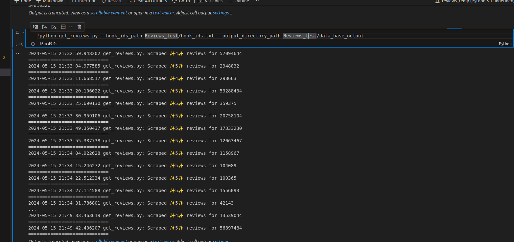
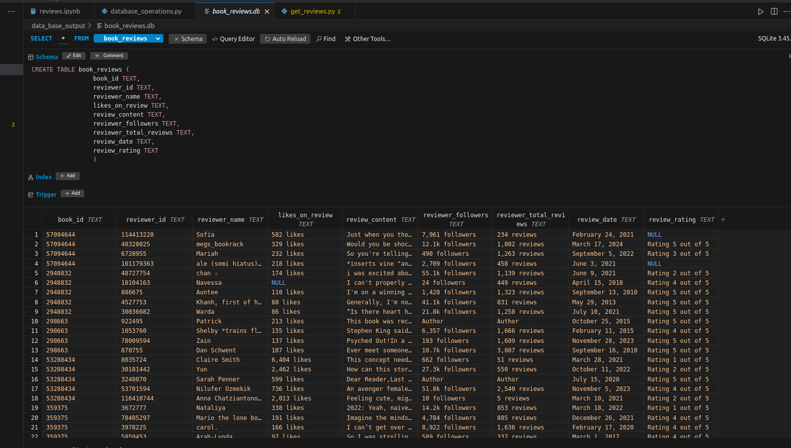

## Example of the working of get_reviews.py

### Input

- `book_ids.txt`: A text file containing Goodreads book IDs.

### Output

- `data_base_output`: Output directory where the database will be created.

### Workflow

1. The script reads the book IDs from the `book_ids.txt` file.
2. It scrapes Goodreads for reviews of each book ID.
3. The retrieved reviews are stored in a SQLite database in the `data_base_output` directory.

### Database Columns:

1. **book_id**: The unique identifier for the book.
2. **reviewer_id**: The unique identifier for the reviewer.
3. **reviewer_name**: The name of the reviewer.
4. **likes_on_review**: The number of likes on the review.
5. **review_content**: The content of the review.
6. **reviewer_followers**: The number of followers the reviewer has.
7. **reviewer_total_reviews**: The total number of reviews the reviewer has made.
8. **review_date**: The date when the review was posted.
9. **review_rating**: The rating given in the review.

## Example Images

### Script Execution

### Database Output
